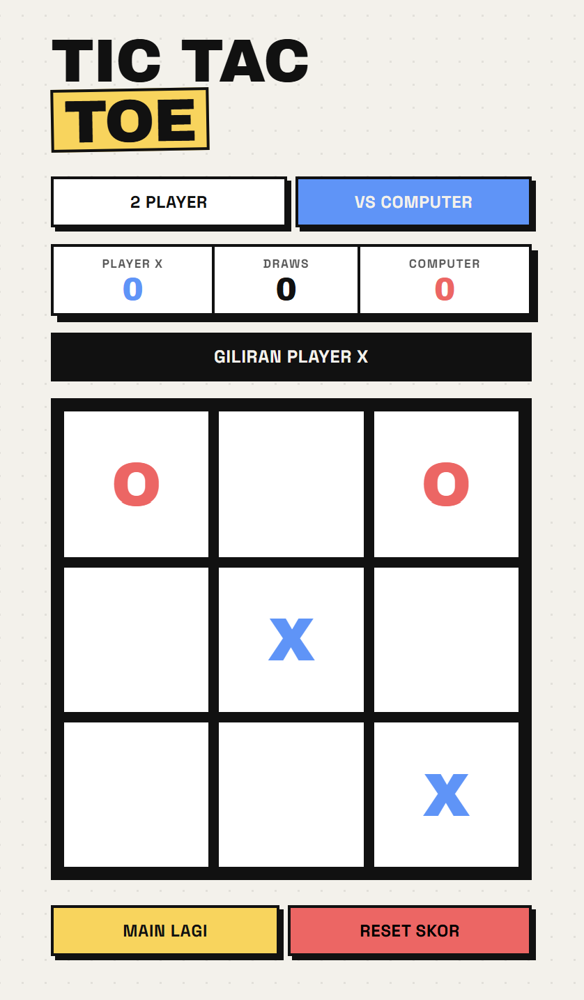

# Tic-Tac-Toe - Web Game
Tic-Tac-Toe web game built with a modern brutalist design aesthetic that prioritizes bold typography and a distinctive, responsive layout. This project offers an engaging experience with both Player vs. Player and Player vs. Computer modes, the latter of which is powered by a robust Minimax algorithm to ensure a challenging and smart AI opponent. Designed for simplicity and speed, the application utilizes native web technologies and persistent browser storage to track your scores, providing a seamless and competitive gaming experience directly in your browser.

## Features
- **Brutalist UI:** Bold typography and a distinctive color palette using CSS grid and flexbox.
- **Game Modes:** Play against a friend or challenge the unbeatable computer.
- **Smart AI:** The computer utilizes the Minimax algorithm to ensure optimal decision-making.
- **Persistent Data:** Player scores are saved locally using the browser's LocalStorage.

## Screenshot

## How to Run
1. Clone the repository.
2. Open `index.html` in any modern web browser.
3. No build step is required; the project uses native JavaScript and Bootstrap 5 CDN.

## License
This project is licensed under the MIT License - see the LICENSE file for details.

**Developed by :** Fitria LM  
**Build Date   :** 08 July 2026
